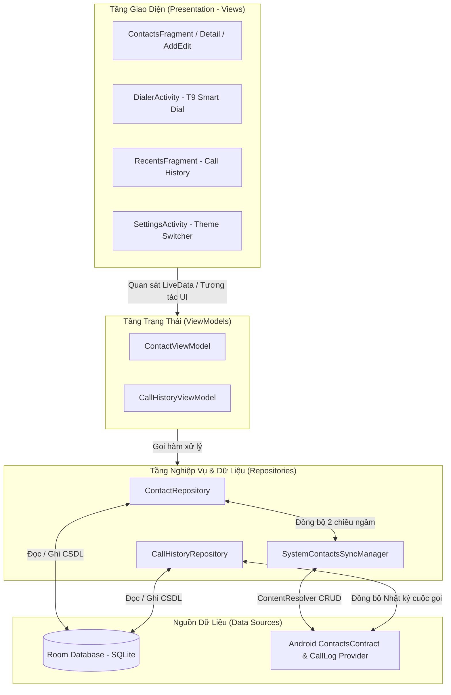
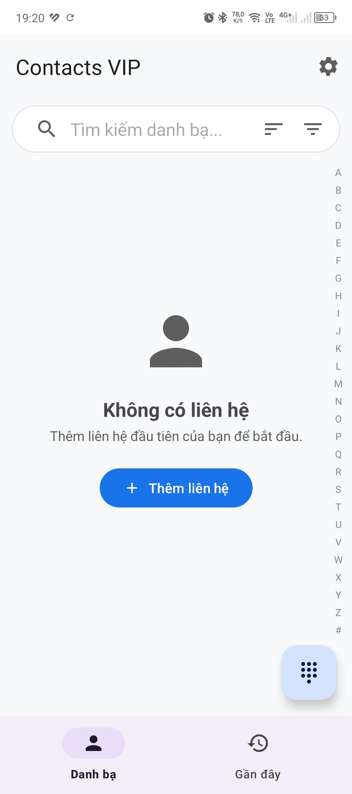
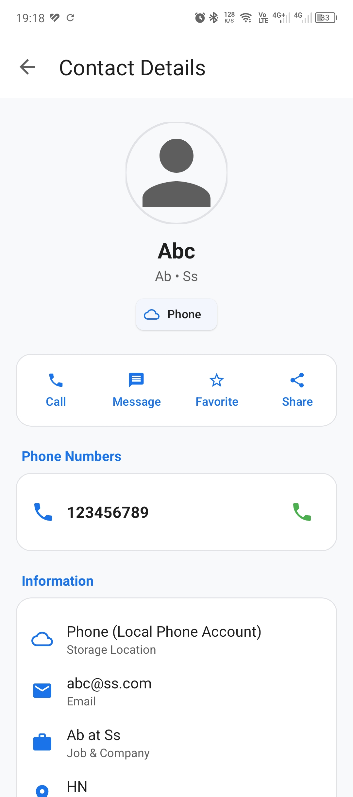
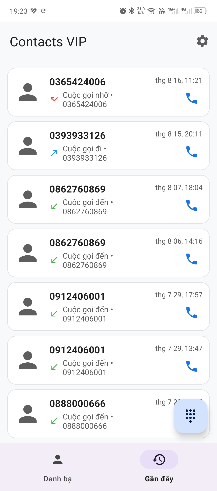
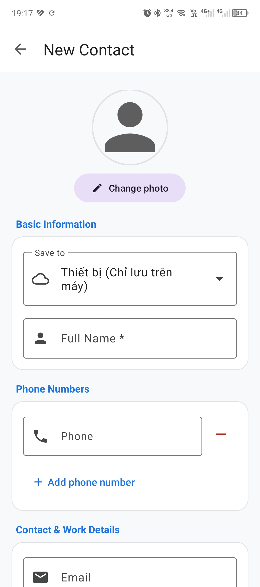
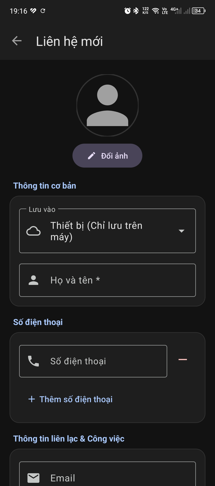
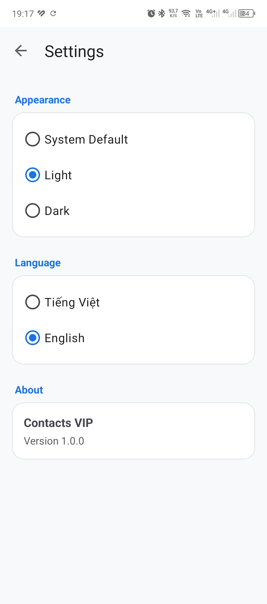

# 🌟 ContactVIP - Smart Phone & Contacts Manager

> **Ứng dụng quản lý Danh bạ, Bàn phím quay số thông minh và Lịch sử cuộc gọi cao cấp cho Android**, xây dựng theo chuẩn kiến trúc **MVVM Clean Architecture**, đồng bộ 2 chiều với hệ điều hành Android và giao diện **Material Design 3** hiện đại (Hỗ trợ Light & Dark Theme).

---

## 📑 Mục Lục Tài Liệu Kỹ Thuật (Documentation Index)

Để tìm hiểu sâu hơn về thiết kế kỹ thuật, vui lòng tham khảo các tài liệu chuyên sâu:

1. 🏗️ **[Kiến Trúc Hệ Thống (Architecture & Concurrency)](docs/ARCHITECTURE.md)**: Chi tiết mô hình phân tầng MVVM, Repository Pattern, Luồng dữ liệu một chiều (UDF) và Quản lý đa luồng.
2. 🗄️ **[Thiết Kế Cơ Sở Dữ Liệu (Room Database & ERD)](docs/DATABASE_DESIGN.md)**: Sơ đồ ERD, cấu trúc bảng `Contact`, `ContactPhone`, `ContactGroup`, `CallHistory`, Indexing và POJO Views.
3. ⚙️ **[Chi Tiết Hoạt Động & Quy Trình (Components & Workflows)](docs/COMPONENTS_AND_WORKFLOWS.md)**: Cơ chế hoạt động của từng màn hình, Sequence Diagrams cho luồng Thêm/Sửa, Quay số T9, Gọi điện và Đồng bộ hệ thống.
4. 🎨 **[Trưng Bày Giao Diện Người Dùng (UI/UX Showcase)](docs/UI_UX_SHOWCASE.md)**: Bộ sưu tập ảnh chụp màn hình thực tế (Light/Dark Mode, Filtering, Detail, History, Settings).

---

## 🏛️ Sơ Đồ Kiến Trúc Tổng Thể (System Architecture)



---

## 📱 Các Tính Năng Nổi Bật

### 1. Quản Lý Danh Bạ Toàn Diện (Contacts Management)
- **Thêm / Sửa liên hệ thông minh**: Hỗ trợ nhiều số điện thoại, gán nhãn tùy biến (Mobile, Home, Work...), email, công ty, chức vụ, địa chỉ và ghi chú.
- **Tùy chọn vị trí lưu trữ**: Lưu vào **Tài khoản Google** (`user@gmail.com`), **Bộ nhớ thiết bị** hoặc **Thẻ SIM**.
- **Chọn ảnh đại diện**: Tích hợp Android PhotoPicker hiện đại với quyền đọc vĩnh viễn (*Persistable URI Permission*).
- **Thanh cuộn nhanh A-Z**: View vẽ tùy biến (`AlphabetIndexView`) hỗ trợ lướt ngón tay tìm kiếm tức thì.
- **Thao tác vuốt (Swipe Actions)**: Vuốt phải để **Gọi điện ngay**, Vuốt trái để **Xóa liên hệ**.
- **Lọc theo nhóm & Sắp xếp**: Phân loại theo nhóm tùy tạo (Gia đình, Bạn bè, Công việc) và sắp xếp A-Z / Z-A.

### 2. Bàn Phím Quay Số Thông Minh (Smart T9 Dialer)
- Bàn phím số T9 phản hồi xúc giác (Haptic Feedback) và âm bấm số.
- Thuật toán T9 Search thời gian thực: Tự động gợi ý danh bạ khớp theo cả số điện thoại hoặc ký tự chữ cái của tên.

### 3. Lịch Sử Cuộc Gọi Chi Tiết (Call History / Recents)
- Phân biệt rõ ràng: **Cuộc gọi đến**, **Cuộc gọi đi**, **Cuộc gọi nhỡ** (Màu đỏ nổi bật).
- Nút **Gọi lại 1 chạm (Quick Recall)** tiện lợi.
- Xóa nhật ký cuộc gọi an toàn với thanh **Hoàn tác (Undo)** trong 4 giây.

### 4. Danh Bạ Yêu Thích (Favorites)
- Đánh dấu sao các liên hệ quan trọng để truy cập nhanh chóng.
- Đồng bộ trạng thái Starred 2 chiều với ứng dụng Danh bạ mặc định của Android.

### 5. Cài Đặt Giao Diện & Cá Nhân Hóa (Themes)
- Chuyển đổi linh hoạt giữa **Giao diện Sáng (Light)**, **Giao diện Tối (Dark)** hoặc **Mặc định theo hệ thống (System Default)** áp dụng ngay lập tức mà không cần khởi động lại ứng dụng.

---

## 📸 Hình Ảnh Giao Diện Thực Tế

| Danh Sách Danh Bạ | Chi Tiết Liên Hệ | Bàn Phím Quay Số & Lịch Sử |
| :---: | :---: | :---: |
|  |  |  |

| Thêm Mới (Light Mode) | Thêm Mới (Dark Mode) | Cài Đặt Giao Diện |
| :---: | :---: | :---: |
|  |  |  |

---

## 🛠️ Công Nghệ & Thư Viện Sử Dụng (Tech Stack)

| Hạng Mục | Công Nghệ / Thư Viện | Mục Đích Sử Dụng |
| :--- | :--- | :--- |
| **Language** | Java 11 / Kotlin | Xây dựng mã nguồn ứng dụng |
| **Target OS** | Android SDK 24 $\rightarrow$ 34 (Android 7.0 đến Android 14/15+) | Đảm bảo tương thích thiết bị rộng rãi |
| **Architecture** | MVVM + Repository Pattern | Phân tách trách nhiệm, dễ bảo trì và kiểm thử |
| **Local Database** | Android Room Database (SQLite) | CSDL cục bộ lưu trữ dữ liệu offline tốc độ cao |
| **UI Components** | Material Design 3 (M3) Components | Thiết kế giao diện hiện đại, chuẩn công thái học |
| **Binding** | Android ViewBinding | Tương tác View an toàn, tránh NullPointerException |
| **Reactive State** | LiveData & ViewModel | Quản lý trạng thái theo vòng đời màn hình |
| **Concurrency** | ExecutorService / ThreadPool (4 worker threads) | Xử lý tác vụ ghi DB và đồng bộ ngầm mượt mà |
| **System Sync** | ContentResolver & ContentObserver | Tự động đồng bộ 2 chiều với Google & SIM Contacts |

---

## 📁 Cấu Trúc Mã Nguồn (Project Structure)

```
app/src/main/java/com/example/contactvip/
├── ContactApplication.java       # Application class khởi tạo Theme toàn cục
├── MainActivity.java             # Activity chính điều hướng Bottom Navigation & FAB
├── adapter/                      # Adapters cho RecyclerView
│   ├── CallHistoryAdapter.java   # Adapter lịch sử cuộc gọi
│   ├── ContactAdapter.java       # Adapter danh sách danh bạ
│   └── FavoriteContactAdapter.java # Adapter liên hệ yêu thích
├── data/                         # Tầng dữ liệu (Data Layer)
│   ├── dao/                      # Room Data Access Objects (Contact, Phone, Group, Call)
│   ├── database/                 # AppDatabase cấu hình Room
│   ├── entity/                   # Các thực thể CSDL (Contact, ContactPhone, CallHistory...)
│   └── repository/               # Repositories & SystemContactsSyncManager
├── ui/                           # Tầng giao diện người dùng (UI Layer)
│   ├── contacts/                 # Fragment danh bạ, Thêm/Sửa, Chi tiết, A-Z Bar
│   ├── dialer/                   # Bàn phím quay số thông minh T9
│   ├── favorites/                # Tab danh bạ yêu thích
│   ├── recents/                  # Tab lịch sử cuộc gọi
│   └── settings/                 # Màn hình cài đặt giao diện Theme
├── utils/                        # Các lớp tiện ích (Account, Avatar, Call, Preference)
└── viewmodel/                    # ViewModels (ContactViewModel, CallHistoryViewModel)
```

---

## 🚀 Hướng Dẫn Cài Đặt & Chạy Ứng Dụng

### Yêu Cầu Môi Trường
- **Android Studio**: Ladybug / Hedgehog hoặc mới hơn.
- **JDK**: Phiên bản 17 hoặc 21.
- **Gradle**: 8.9+.

### Các Bước Thực Hiện
1. Clone dự án về máy:
   ```bash
   git clone https://github.com/username/contactvip.git
   cd contactvip
   ```
2. Mở dự án trong **Android Studio** và đồng bộ Gradle (*Sync Project with Gradle Files*).
3. Biên dịch và tạo file APK Debug:
   ```bash
   ./gradlew assembleDebug
   ```
4. Chạy Unit Test kiểm tra logic:
   ```bash
   ./gradlew testDebugUnitTest
   ```
5. Cài đặt trực tiếp lên thiết bị Android hoặc máy ảo Emulator.

---

## 📄 Bản Quyền & Giấy Phép (License)

Dự án được phân phối dưới giấy phép mã nguồn mở **MIT License**. Mọi đóng góp và phát triển thêm đều được hoan nghênh!
