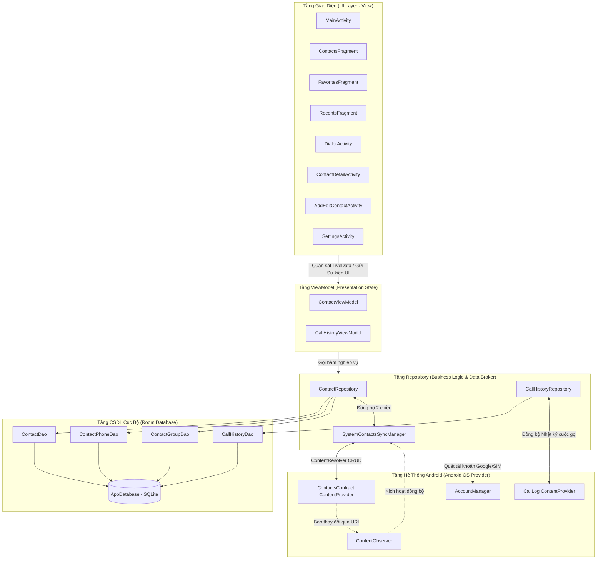
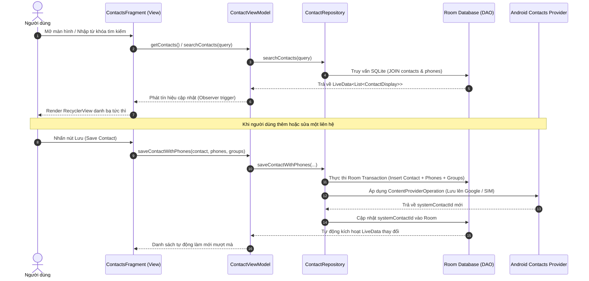

# Kiến Trúc Hệ Thống ContactVIP (System Architecture)

Tài liệu này mô tả chi tiết toàn bộ kiến trúc kỹ thuật, mô hình phân tầng, luồng dữ liệu (Data Flow) và cơ chế xử lý bất đồng bộ trong ứng dụng **ContactVIP**.

---

## 1. Tổng Quan Kiến Trúc (Architecture Overview)

Ứng dụng ContactVIP được thiết kế tuân thủ nghiêm ngặt theo mô hình **MVVM (Model - View - ViewModel)** kết hợp với **Repository Pattern** theo tiêu chuẩn Android Architecture Components (AAC) và Clean Architecture principles.

---

## 2. Chi Tiết Các Tầng Kỹ Thuật

### 2.1. Tầng Giao Diện (UI Layer - View)
- **Công nghệ cốt lõi**: `Activity`, `Fragment`, `ViewBinding`, `Material Components (M3)`.
- **Nhiệm vụ**:
  - Render giao diện người dùng, lắng nghe tương tác (touch, click, swipe, scroll).
  - Đăng ký quan sát (`observe`) các luồng `LiveData` phát ra từ `ViewModel` và tự động cập nhật UI tương ứng khi dữ liệu thay đổi.
  - Hoàn toàn **không** chứa logic nghiệp vụ hoặc truy vấn dữ liệu trực tiếp.
  - Quản lý vòng đời an toàn (`LifecycleOwner`), giải phóng tài nguyên tránh Memory Leak.

### 2.2. Tầng ViewModel (State Holder)
- **Thành phần**: `ContactViewModel`, `CallHistoryViewModel`.
- **Nhiệm vụ**:
  - Kế thừa `AndroidViewModel`, duy trì dữ liệu qua các sự kiện cấu hình (như xoay màn hình, chuyển dark mode).
  - Đóng gói dữ liệu hiển thị dưới dạng `LiveData<T>` (ví dụ `LiveData<List<ContactDisplay>>`).
  - Là cầu nối duy nhất giữa UI và Repository, chuyển đổi yêu cầu từ View thành các lệnh xử lý dữ liệu.

### 2.3. Tầng Repository (Data Access & Synchronization)
- **Thành phần**: `ContactRepository`, `CallHistoryRepository`, `SystemContactsSyncManager`.
- **Nhiệm vụ**:
  - **Single Source of Truth**: Điểm truy cập dữ liệu duy nhất cho toàn ứng dụng.
  - Quản lý cơ chế đồng bộ 2 chiều (Bidirectional Sync) giữa CSDL cục bộ `Room DB` và `Android OS System Providers`.
  - Phối hợp các thao tác ghi đa bảng (Multi-table transactions) như lưu Contact cùng lúc với danh sách Phone Numbers và Groups.

### 2.4. Tầng Dữ Liệu Cục Bộ (Room Database)
- **Thành phần**: `AppDatabase`, `ContactDao`, `ContactPhoneDao`, `ContactGroupDao`, `CallHistoryDao`.
- **Nhiệm vụ**:
  - Lưu trữ dữ liệu SQLite cục bộ bền vững trên thiết bị, cho phép ứng dụng phản hồi tức thì và hoạt động hoàn toàn Offline.
  - Trả về `LiveData<List<T>>` tự động kích hoạt phát tín hiệu (`notify`) khi có thay đổi trong bảng dữ liệu.

---

## 3. Luồng Dữ Liệu Một Chiều (Unidirectional Data Flow)

Dữ liệu di chuyển theo một chiều khép kín, đảm bảo tính nhất quán và dễ debug:

---

## 4. Mô Hình Đa Luồng & Bất Đồng Bộ (Concurrency Model)

Để đảm bảo giao diện luôn mượt mà ở tần số quét 60/120 FPS, ứng dụng áp dụng phân chia luồng nghiêm ngặt:

```mermaid
graph LR
    subgraph Main_Thread["Luồng Chính (UI / Main Thread)"]
        UI[Render Views]
        Animations[Animation & Ripple]
        LiveDataObs[LiveData Observers]
        InputEvents[Sự kiện chạm / Phím bấm]
    end

    subgraph Background_Threads["Luồng Nền (Background Worker Threads)"]
        Executor["ThreadPool / ExecutorService (AppDatabase.databaseWriteExecutor)"]
        RoomIO["Room DB Read / Write IO"]
        SyncTask["Quét & Phân tích Danh bạ Hệ thống"]
        ImageProcessing["Nạp & Nén Ảnh Avatar"]
        CallLogSync["Đồng bộ Nhật ký cuộc gọi"]
    end

    Main_Thread -->|Dispatch tác vụ ngầm| Background_Threads
    Background_Threads -->|Post dữ liệu qua LiveData / runOnUiThread| Main_Thread
```

1. **`AppDatabase.databaseWriteExecutor`**: Sử dụng `Executors.newFixedThreadPool(4)` để xử lý tất cả các câu lệnh ghi (`INSERT`, `UPDATE`, `DELETE`) và truy vấn nặng.
2. **`LiveData` Reactive Stream**: Room tự động chạy truy vấn đọc trên background thread và chuyển kết quả về Main Thread an toàn.
3. **`ContentObserver` Debounce**: Cơ chế lắng nghe thay đổi danh bạ hệ thống sử dụng thuật toán **Debounce 1500ms** để gộp nhiều sự kiện ghi liên tiếp thành 1 lần đồng bộ duy nhất, triệt tiêu hiện tượng lag CPU khi có batch import.

---

## 5. Cơ Chế Xử Lý Ngoại Lệ & An Toàn Ứng Dụng (Error Handling & Safety)

- **Quyền Runtime An Toàn (Permissions Graceful Degradation)**:
  - Nếu người dùng chưa cấp quyền `READ_CONTACTS` hoặc `CALL_PHONE`, ứng dụng vẫn hoạt động bình thường với CSDL nội bộ độc lập mà không bao giờ bị crash.
  - Khi thực hiện cuộc gọi: Tự động dùng `ACTION_CALL` nếu đã có quyền, hoặc fallback mượt mà sang `ACTION_DIAL` nếu chưa có quyền.
- **Bảo toàn Khóa Ngoại (Foreign Key Integrity)**:
  - Bảng `contact_phones` và `contact_group_cross_ref` liên kết với `contacts` bằng khóa ngoại có `onDelete = ForeignKey.CASCADE`. Khi một liên hệ bị xóa, tất cả số điện thoại và liên kết nhóm sẽ tự động được dọn dẹp sạch sẽ, không để lại rác trong database.
- **URI Permission Persistence**:
  - Khi người dùng chọn ảnh đại diện qua Android PhotoPicker, ứng dụng gọi `takePersistableUriPermission()` để duy trì quyền đọc ảnh ngay cả khi thiết bị khởi động lại.
