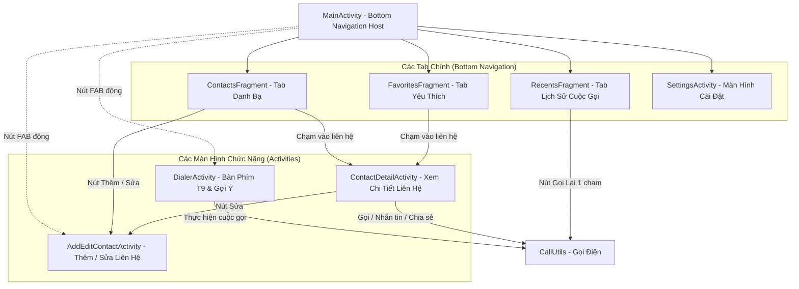
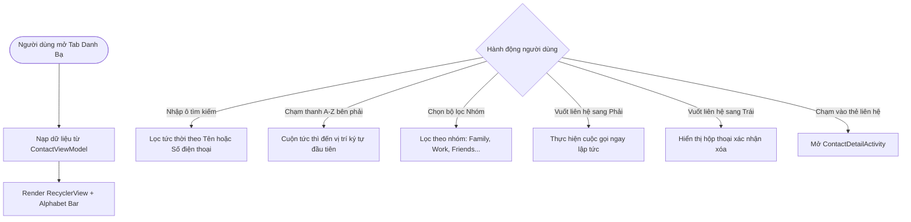
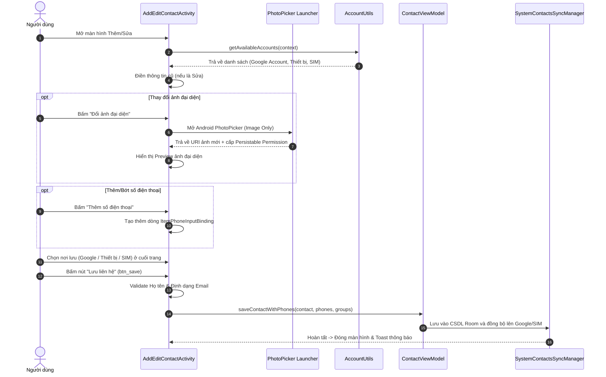
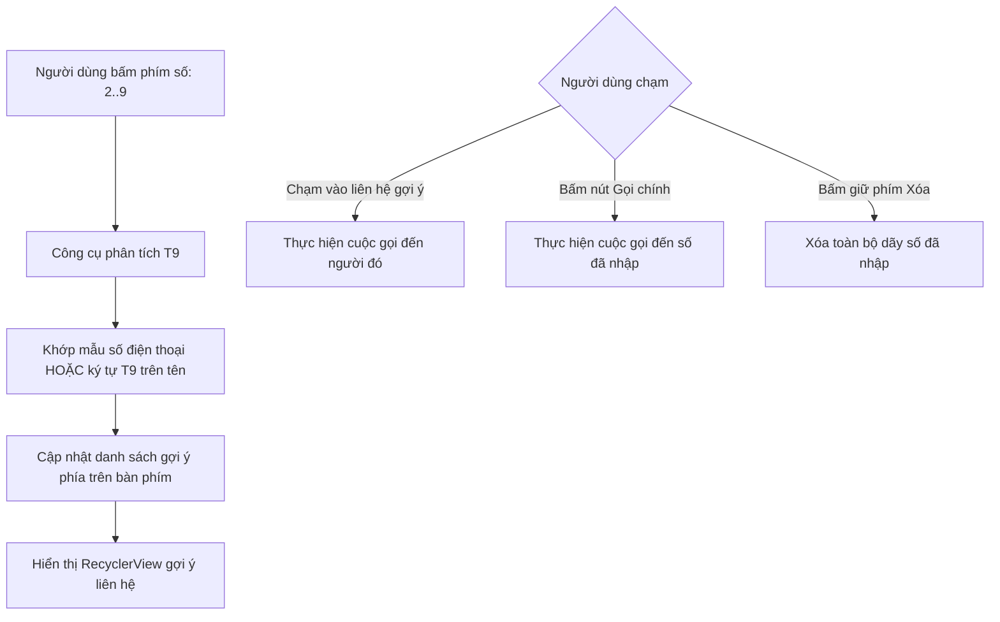
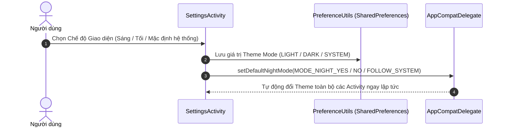
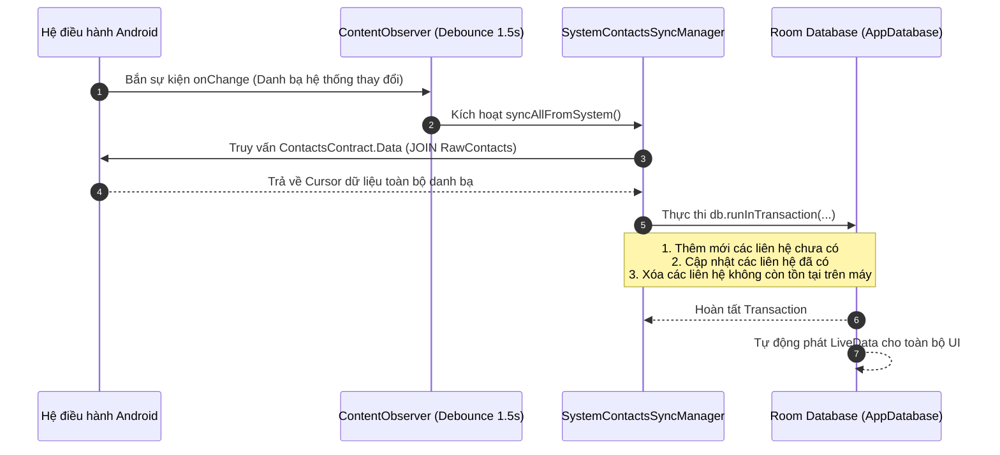

# Chi Tiết Hoạt Động & Quy Trình Từng Thành Phần (Components & Workflows)

Tài liệu này giải thích chi tiết cơ chế vận hành, quy trình xử lý (Workflows) và tương tác qua lại giữa các màn hình, thành phần trong hệ thống **ContactVIP**.

---

## 1. Bản Đồ Thành Phần Ứng Dụng (Component Map)

---

## 2. Chi Tiết Các Thành Phần Cốt Lõi

### 2.1. `MainActivity` & Điều Hướng Động (Dynamic FAB Navigation)
- **Vai trò**: Điểm vào chính của ứng dụng, lưu trữ `BottomNavigationView` chứa 4 màn hình: **Danh bạ**, **Yêu thích**, **Gần đây**, **Cài đặt**.
- **Cơ chế Nút Hành Động Nổi (Floating Action Button - FAB)**:
  - Khi người dùng ở Tab **Danh bạ**: FAB tự động chuyển sang icon **Thêm mới (`ic_add`)** $\rightarrow$ bấm vào sẽ mở `AddEditContactActivity`.
  - Khi người dùng ở các Tab khác (**Yêu thích, Gần đây, Cài đặt**): FAB tự động chuyển sang icon **Bàn phím quay số (`ic_dialer`)** $\rightarrow$ bấm vào sẽ mở `DialerActivity`.

---

### 2.2. Module Danh Sách Danh Bạ (`ContactsFragment`, `ContactAdapter`, `AlphabetIndexView`)

- **Thanh Chỉ Mục A-Z (`AlphabetIndexView`)**: View tùy biến vẽ 26 ký tự chữ cái dọc theo mép phải màn hình, hỗ trợ cử chỉ vuốt ngón tay (`ACTION_MOVE`) để cuộn danh bạ tức thì kèm phản hồi haptic.
- **Vuốt Để Thao Tác (`ContactSwipeCallback`)**: Tích hợp `ItemTouchHelper` vẽ icon nền:
  - Vuốt phải: Nền xanh lá + Icon Gọi điện $\rightarrow$ Gọi số điện thoại chính.
  - Vuốt trái: Nền đỏ + Icon Thùng rác $\rightarrow$ Xác nhận xóa liên hệ.

---

### 2.3. Module Thêm / Chỉnh Sửa Danh Bạ (`AddEditContactActivity`)

- **Quản lý đa số điện thoại động**: Sử dụng `ItemPhoneInputBinding` được thêm/bớt động vào `LinearLayout container`.
- **Hỗ trợ chọn vị trí lưu (`AccountUtils`)**: Tự động phát hiện các tài khoản Google đã đăng nhập và các tài khoản thiết bị để người dùng quyết định nơi lưu trữ danh bạ.

---

### 2.4. Module Xem Chi Tiết Danh Bạ (`ContactDetailActivity`)
- **Avatar Hero Header**: Hiển thị ảnh đại diện kích thước lớn, tự động tạo Avatar chữ cái màu sắc ngẫu nhiên chuẩn Material nếu không có ảnh.
- **Huy Hiệu Vị Trí Lưu (Storage Account Badge)**: Hiển thị ngay dưới tên liên hệ (ví dụ: `Google: user@gmail.com` hoặc `Thiết bị`).
- **Thanh Thao Tác Nhanh (Quick Actions)**:
  - **Gọi điện (`ic_call`)**: Gọi số điện thoại chính.
  - **Nhắn tin (`ic_message`)**: Mở ứng dụng SMS mặc định gửi tin nhắn.
  - **Yêu thích (`ic_star`)**: Bật/tắt trạng thái Starred tức thì.
  - **Chia sẻ (`ic_share`)**: Chia sẻ thông tin liên hệ dưới dạng văn bản (Họ tên + Các số điện thoại + Email).
- **Xử lý Trạng Thái Rỗng (Empty States)**: Khi một liên hệ không có Email, Công ty, Địa chỉ hoặc Ghi chú, màn hình hiển thị thông báo *"Chưa có thông tin bổ sung"* tinh tế, giữ giao diện luôn cân đối.

---

### 2.5. Module Bàn Phím Quay Số Thông Minh (`DialerActivity` - Smart T9 Dialer)

- **Bản đồ T9 Keypad**:
  - `2: ABC`, `3: DEF`, `4: GHI`, `5: JKL`, `6: MNO`, `7: PQRS`, `8: TUV`, `9: WXYZ`.
- **Tìm kiếm kết hợp**: Khớp đồng thời số điện thoại và chuỗi ký tự chuyển đổi từ chữ cái họ tên sang số T9.

---

### 2.6. Module Lịch Sử Cuộc Gọi (`RecentsFragment`, `CallHistoryAdapter`)
- **Phân loại cuộc gọi trực quan**:
  - `INCOMING`: Icon mũi tên xanh lá chỉ xuống.
  - `OUTGOING`: Icon mũi tên xanh dương chỉ lên.
  - `MISSED`: Icon cuộc gọi nhỡ màu **Đỏ rực** nổi bật, kèm số điện thoại màu đỏ để người dùng dễ nhận biết.
  - `REJECTED`: Icon từ chối cuộc gọi.
- **Nút Gọi Lại 1 Chạm (Quick Callback)**: Nút gọi nhanh bên phải mỗi dòng cho phép gọi lại ngay lập tức.
- **Xóa & Hoàn Tác (Delete with Undo)**: Khi xóa lịch sử cuộc gọi, một thanh `Snackbar` sẽ xuất hiện với nút **"Hoàn tác" (Undo)** trong 4 giây trước khi dữ liệu thực sự bị xóa vĩnh viễn khỏi hệ thống.

---

### 2.7. Module Cài Đặt Giao Diện (`SettingsActivity`, `PreferenceUtils`)

---

### 2.8. Module Đồng Bộ Hệ Thống (`SystemContactsSyncManager`)

