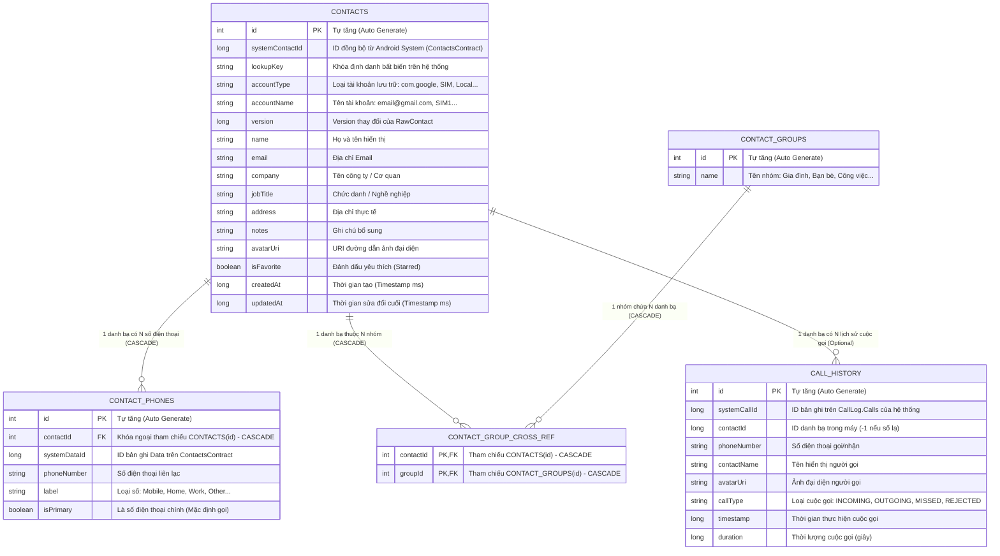

# Thiết Kế Cơ Sở Dữ Liệu ContactVIP (Database Design)

Tài liệu này cung cấp chi tiết thiết kế Cơ sở dữ liệu Cục bộ (**Room Database**), bao gồm Sơ đồ Quan hệ Thực thể (ERD), cấu trúc bảng, khóa ngoại, chỉ mục (Index), Data Access Objects (DAOs) và các mô hình dữ liệu tổng hợp (POJO Views).

---

## 1. Sơ Đồ Quan Hệ Thực Thể (Entity Relationship Diagram - ERD)



---

## 2. Chi Tiết Các Bảng & Cấu Trúc Thực Thể (Entity Schemas)

### 2.1. Bảng `contacts` (Thông Tin Danh Bạ Chính)
- **Tên lớp**: `com.example.contactvip.data.entity.Contact`
- **Mô tả**: Lưu trữ hồ sơ liên hệ cốt lõi.

| Tên Cột | Kiểu Dữ Liệu SQLite | Ràng Buộc | Ý Nghĩa Kỹ Thuật |
| :--- | :--- | :--- | :--- |
| `id` | `INTEGER` | `PRIMARY KEY AUTOINCREMENT` | Khóa chính nội bộ của Room DB |
| `systemContactId` | `INTEGER` | `NULLABLE` | ID liên kết với `ContactsContract.Contacts._ID` |
| `lookupKey` | `TEXT` | `NULLABLE` | Khóa Lookup của Android OS (duy trì ngay cả khi ID thay đổi) |
| `accountType` | `TEXT` | `NULLABLE` | Gốc tài khoản (`com.google`, `vnd.sec.contact.sim`, `null`...) |
| `accountName` | `TEXT` | `NULLABLE` | Tên tài khoản Google hoặc SIM tương ứng |
| `version` | `INTEGER` | `DEFAULT 0` | Dùng để kiểm tra xung đột phiên bản khi đồng bộ |
| `name` | `TEXT` | `NULLABLE` | Họ và tên |
| `email` | `TEXT` | `NULLABLE` | Địa chỉ email |
| `company` | `TEXT` | `NULLABLE` | Công ty |
| `jobTitle` | `TEXT` | `NULLABLE` | Chức vụ |
| `address` | `TEXT` | `NULLABLE` | Địa chỉ |
| `notes` | `TEXT` | `NULLABLE` | Ghi chú cá nhân |
| `avatarUri` | `TEXT` | `NULLABLE` | Chuỗi URI ảnh đại diện cục bộ hoặc Content URI |
| `isFavorite` | `INTEGER` | `BOOLEAN (0 hoặc 1)` | Trạng thái yêu thích |
| `createdAt` | `INTEGER` | `DEFAULT 0` | Timestamp ngày tạo |
| `updatedAt` | `INTEGER` | `DEFAULT 0` | Timestamp cập nhật |

---

### 2.2. Bảng `contact_phones` (Danh Sách Số Điện Thoại - Quan Hệ 1:N)
- **Tên lớp**: `com.example.contactvip.data.entity.ContactPhone`
- **Mô tả**: Cho phép một liên hệ có nhiều số điện thoại (ví dụ: số Di động, số Nhà riêng, số Cơ quan).

| Tên Cột | Kiểu Dữ Liệu | Ràng Buộc | Ý Nghĩa Kỹ Thuật |
| :--- | :--- | :--- | :--- |
| `id` | `INTEGER` | `PRIMARY KEY AUTOINCREMENT` | Khóa chính |
| `contactId` | `INTEGER` | `FOREIGN KEY` (Cascade Delete) | Tham chiếu đến `contacts.id`. Đánh `INDEX` tăng tốc truy vấn |
| `systemDataId`| `INTEGER` | `NULLABLE` | ID bản ghi `Data._ID` trên hệ thống Android |
| `phoneNumber` | `TEXT` | `NOT NULL` | Chuỗi số điện thoại |
| `label` | `TEXT` | `DEFAULT 'Mobile'` | Nhãn số điện thoại (`Mobile`, `Home`, `Work`, `Other`) |
| `isPrimary` | `INTEGER` | `BOOLEAN (0 hoặc 1)` | `true` nếu là số mặc định được ưu tiên gọi |

---

### 2.3. Bảng `contact_groups` & `contact_group_cross_ref` (Nhóm Danh Bạ - Quan Hệ N:N)
- **Tên lớp**: `ContactGroup` và `ContactGroupCrossRef`
- **Mô tả**: Cho phép một danh bạ thuộc nhiều nhóm (Gia đình, Bạn bè, Đồng nghiệp) và một nhóm chứa nhiều danh bạ.

**Bảng `contact_groups`**:
| Tên Cột | Kiểu Dữ Liệu | Ràng Buộc | Ý Nghĩa |
| :--- | :--- | :--- | :--- |
| `id` | `INTEGER` | `PRIMARY KEY AUTOINCREMENT` | Khóa chính nhóm |
| `name` | `TEXT` | `NOT NULL` | Tên nhóm hiển thị |

**Bảng `contact_group_cross_ref`** (Khóa phức hợp `PRIMARY KEY(contactId, groupId)`):
| Tên Cột | Kiểu Dữ Liệu | Ràng Buộc | Ý Nghĩa |
| :--- | :--- | :--- | :--- |
| `contactId` | `INTEGER` | `FOREIGN KEY` (Cascade Delete) | Tham chiếu `contacts.id` |
| `groupId` | `INTEGER` | `FOREIGN KEY` (Cascade Delete) | Tham chiếu `contact_groups.id` |

---

### 2.4. Bảng `call_history` (Nhật Ký Cuộc Gọi)
- **Tên lớp**: `com.example.contactvip.data.entity.CallHistory`
- **Mô tả**: Lưu trữ chi tiết tất cả cuộc gọi đến, đi, nhỡ và từ chối.

| Tên Cột | Kiểu Dữ Liệu | Ràng Buộc | Ý Nghĩa |
| :--- | :--- | :--- | :--- |
| `id` | `INTEGER` | `PRIMARY KEY AUTOINCREMENT` | Khóa chính |
| `systemCallId`| `INTEGER` | `DEFAULT 0` | ID từ `CallLog.Calls._ID` của hệ điều hành |
| `contactId` | `INTEGER` | `DEFAULT -1` | ID liên kết danh bạ (dùng để nạp avatar nhanh) |
| `phoneNumber` | `TEXT` | `NOT NULL` | Số điện thoại |
| `contactName` | `TEXT` | `NULLABLE` | Tên danh bạ hoặc tên lưu tạm |
| `avatarUri` | `TEXT` | `NULLABLE` | URI ảnh đại diện |
| `callType` | `TEXT` | `NOT NULL` | `INCOMING`, `OUTGOING`, `MISSED`, `REJECTED` |
| `timestamp` | `INTEGER` | `NOT NULL` | Thời điểm gọi (Epoch millisecond) |
| `duration` | `INTEGER` | `DEFAULT 0` | Thời lượng đàm thoại (tính theo giây) |

---

## 3. Mô Hình Tổng Hợp Dữ Liệu (POJO View - `ContactDisplay`)

Để tối ưu hiệu năng và tránh việc phải thực hiện câu lệnh `SELECT` lặp đi lặp lại (N+1 query problem) trong `RecyclerView`, ứng dụng sử dụng lớp POJO `ContactDisplay`:

```java
public class ContactDisplay {
    @Embedded
    public Contact contact;
    
    public String primaryPhone; // Số điện thoại chính được JOIN trực tiếp trong SQL
}
```

### Câu Lệnh Truy Vấn Tối Ưu (SQL Query):
```sql
SELECT c.*, p.phoneNumber AS primaryPhone 
FROM contacts c 
LEFT JOIN contact_phones p ON c.id = p.contactId AND p.isPrimary = 1 
GROUP BY c.id 
ORDER BY c.name COLLATE NOCASE ASC;
```

---

## 4. Tối Ưu Hóa & Chỉ Mục (Indexing & Optimization Strategies)

1. **Foreign Key Indexing**: Mọi khóa ngoại `contactId`, `groupId` đều được khai báo `@Index` trong Room để tăng tốc độ join bảng lên gấp nhiều lần.
2. **Collate NOCASE**: Tên liên hệ được sắp xếp bằng `COLLATE NOCASE` giúp việc hiển thị theo thứ tự bảng chữ cái A-Z chuẩn xác, không phân biệt hoa thường.
3. **Transaction Batching**: Tất cả các thao tác ghi hàng loạt (`saveContactWithPhones`, `syncAllFromSystem`, `replaceAll`) đều được bọc trong `db.runInTransaction(...)`, đảm bảo tính toàn vẹn dữ liệu nguyên tử (ACID) và giảm thiểu tối đa thời gian I/O xuống bộ nhớ Flash.
