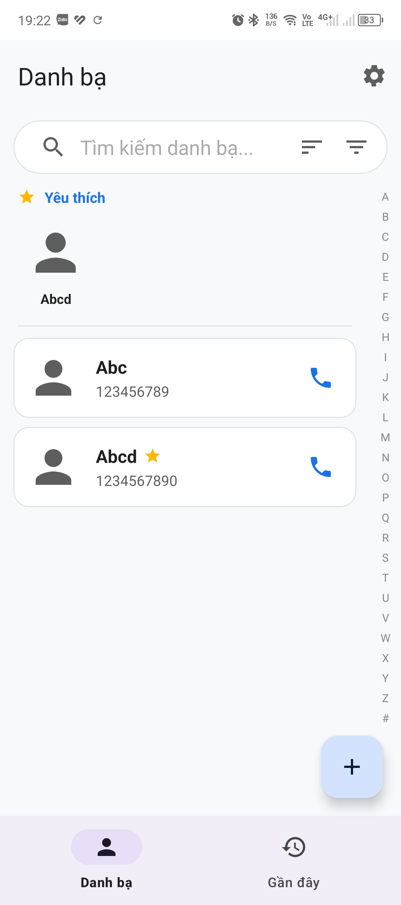
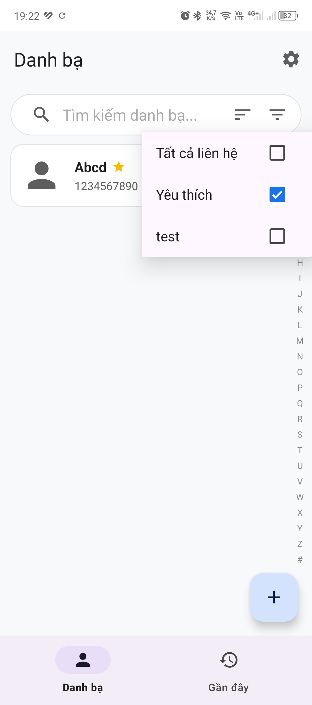
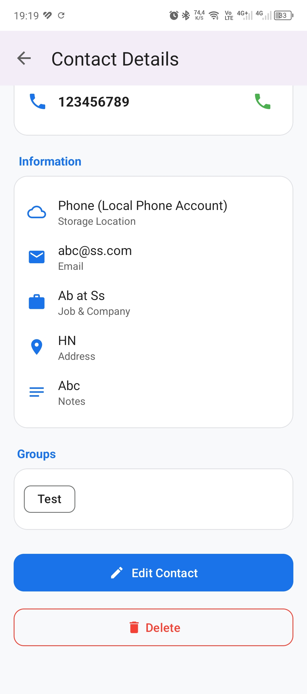
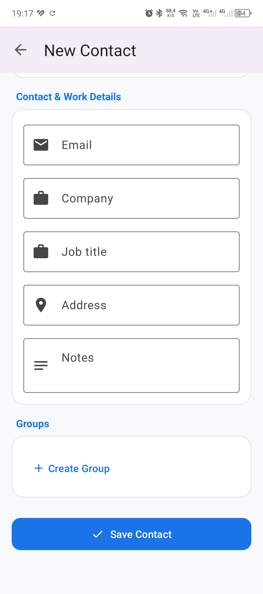
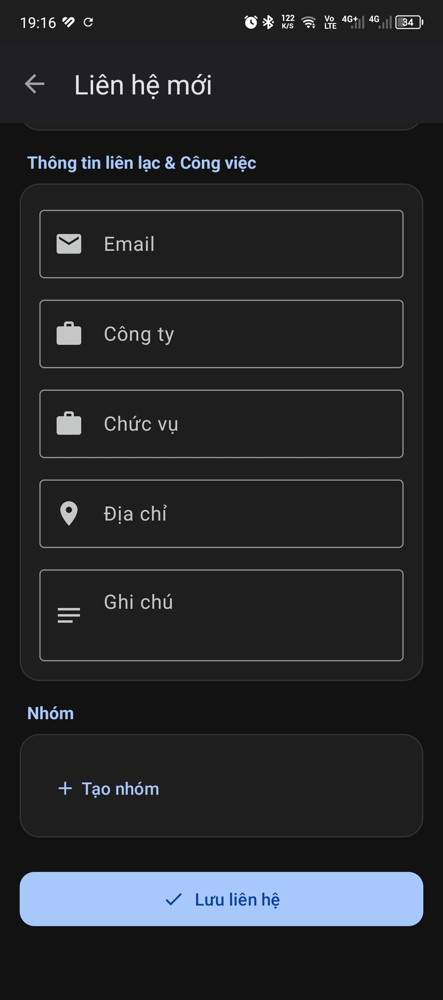
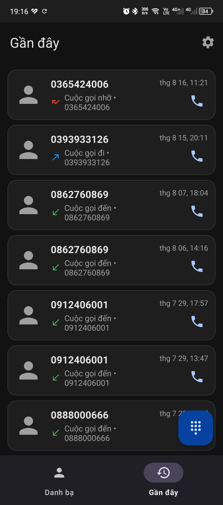
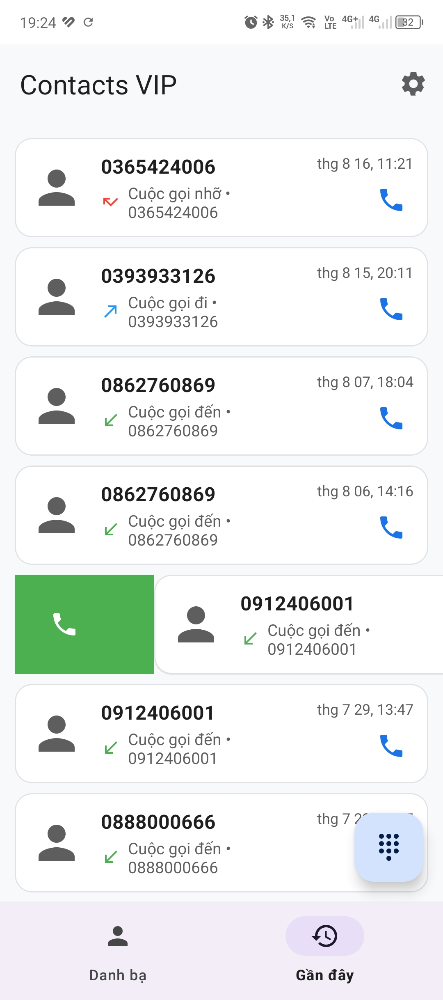
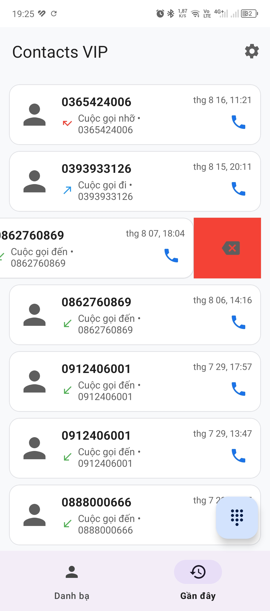
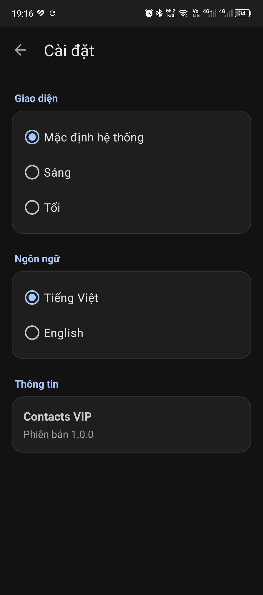

# Trưng Bày Giao Diện Người Dùng & Trải Nghiệm (UI/UX Showcase)

Tài liệu này tổng hợp hình ảnh giao diện thực tế, hệ thống bảng màu Material Design 3 và phân tích chi tiết trải nghiệm người dùng (UX) của ứng dụng **ContactVIP**.

---

## 1. Hệ Thống Thiết Kế (Design System)

ContactVIP tuân thủ toàn diện theo nguyên lý thiết kế **Google Material Design 3 (M3)**:
- **Hệ thống phân cấp thị giác (Visual Hierarchy)**: Sử dụng các thẻ bo góc lớn (`MaterialCardView` 16dp radius), phân tách các khối nội dung logic mạch lạc.
- **Tương phản chuẩn công thái học**: Màu sắc, độ tương phản văn bản và biểu tượng tuân thủ chuẩn tương phản WCAG AA/AAA.
- **Hỗ trợ Chế độ Sáng & Tối (Light & Dark Themes)**: Chuyển đổi mượt mà giữa tone màu sáng thanh lịch và tone màu tối sâu dịu mắt, tiết kiệm pin cho màn hình OLED/AMOLED.

---

## 2. Thư Viện Ảnh Chụp Giao Diện Thực Tế

### 2.1. Màn Hình Danh Sách Danh Bạ & Bộ Lọc (Contacts & Filtering)
Giao diện danh sách danh bạ với thanh chỉ mục nhanh A-Z bên phải, hỗ trợ lọc theo nhóm và tìm kiếm tức thì.

| Danh Sách Danh Bạ (Chính) | Cuộn Chỉ Mục A-Z | Bộ Lọc Theo Nhóm |
| :---: | :---: | :---: |
|  |  |  |

---

### 2.2. Màn Hình Xem Chi Tiết Liên Hệ (Contact Details)
Hiển thị đầy đủ thông tin liên hệ, ảnh đại diện Hero lớn, huy hiệu vị trí lưu trữ (Google Account / SIM / Thiết bị), thanh tác vụ nhanh và danh sách các số điện thoại.

| Chi Tiết Liên Hệ (Phần Đầu) | Chi Tiết Liên Hệ (Thông Tin Bổ Sung) |
| :---: | :---: |
|  |  |

---

### 2.3. Màn Hình Thêm & Chỉnh Sửa Liên Hệ (Create / Edit Contact)
Cho phép nhập nhiều số điện thoại, đổi ảnh đại diện từ thư viện ảnh (PhotoPicker), chọn nhóm và tùy chọn vị trí lưu danh bạ xuống tài khoản Google hoặc Thiết bị ở cuối form.

#### Chế Độ Sáng (Light Mode):
| Thêm Mới - Thông Tin Cơ Bản | Thêm Mới - Nhóm & Vị Trí Lưu |
| :---: | :---: |
|  |  |

#### Chế Độ Tối (Dark Mode):
| Tạo Liên Hệ (Dark Mode 1) | Tạo Liên Hệ (Dark Mode 2) |
| :---: | :---: |
|  |  |

---

### 2.4. Màn Hình Lịch Sử Cuộc Gọi & Thao Tác Nhanh (Call History & Quick Actions)
Phân loại cuộc gọi rõ ràng (Đến, Đi, Nhỡ - màu đỏ), hỗ trợ nút gọi lại 1 chạm và thao tác xóa có thanh thông báo Hoàn tác (Undo).

| Lịch Sử Cuộc Gọi (Light) | Lịch Sử Cuộc Gọi (Dark) |
| :---: | :---: |
|  |  |

| Gọi Lại Nhanh 1 Chạm | Xóa Lịch Sử & Hoàn Tác (Undo) |
| :---: | :---: |
|  |  |

---

### 2.5. Màn Hình Cài Đặt Giao Diện (Settings & Themes)
Cung cấp tùy chọn chuyển đổi giữa Giao diện Sáng, Giao diện Tối hoặc Tự động theo Hệ thống (System Default) áp dụng tức thì.

| Cài Đặt (Light Theme) | Cài Đặt (Dark Theme) |
| :---: | :---: |
|  |  |

---

## 3. Điểm Nhấn Trải Nghiệm Người Dùng (UX Highlights)

1. **Hiệu ứng Haptic & Chạm Phản Hồi (Micro-interactions)**:
   - Các nút bấm đều tích hợp Material Ripple Effect.
   - Thao tác cuộn trên thanh chữ cái A-Z mang lại cảm giác mượt mà và trực quan.
2. **Bảo vệ Thao Tác Người Dùng (Destructive Action Safeguards)**:
   - Xóa liên hệ luôn hiển thị hộp thoại xác nhận (Confirmation Dialog).
   - Xóa lịch sử cuộc gọi cung cấp thanh Hoàn tác (Undo Snackbar) trong 4 giây.
3. **Empty States Tinh Tế**:
   - Khi không có danh bạ hoặc không có thông tin bổ sung, hệ thống hiển thị hình minh họa và hướng dẫn rõ ràng, không để khoảng trống vô nghĩa trên màn hình.
